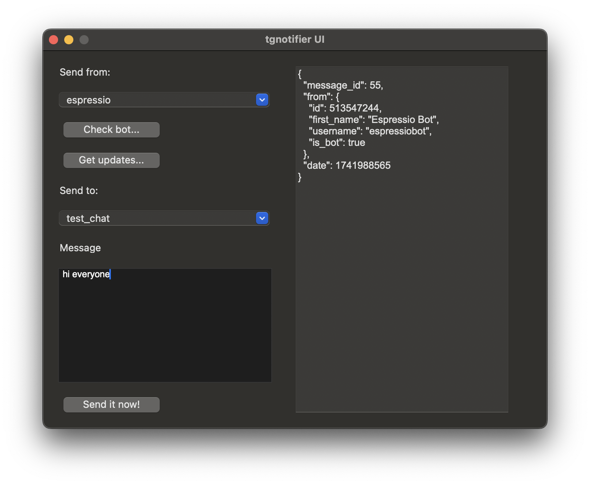
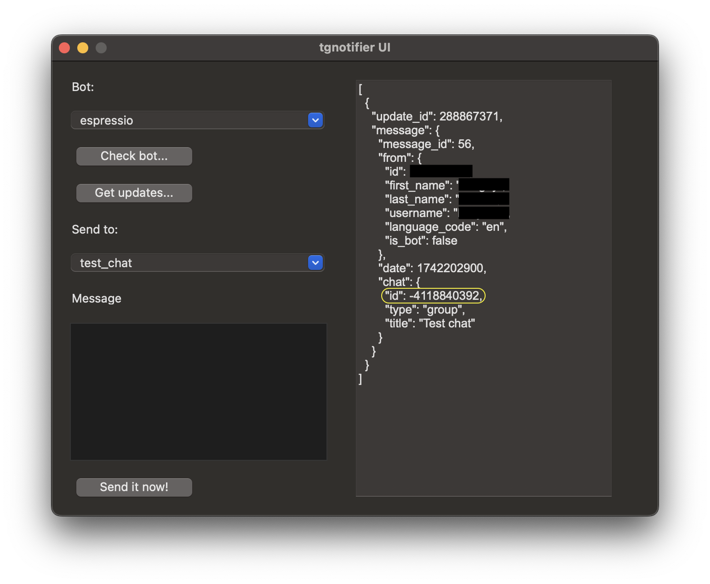

# tgnotifier GUI

The `tgnotifierui` app is a GUI wrapper for a `tgnotifier`.



## Installation

For now, the GUI binary is available only for a macOS on the Apple chip:
[tgnotifierui_v1.0.1_macOS-v15.3.1_arm64](https://github.com/kukymbr/tgnotifier/releases/download/v1.0.1/tgnotifierui_v1.0.1_macOS-v15.3.1_arm64)

For other platforms it's possible to build GUI from the sources:

```shell
git clone https://github.com/kukymbr/tgnotifier.git && cd tgnotifier
git checkout v1.0.1
make build_gui
./tgnotifierui --version
```

## Starting the GUI

To run the `tgnotifierui`:

1. Follow the steps from the [Configuration](../README.md#configuration) 
   section in the main doc to create a configuration file.
2. Run the app:
   * from the console if you need to specify a path to a config file:
     ```shell
      # If you need to specify a path to a config file:
      tgnotifierui --config=/path/to/.tgnotifier.yml
     ```
   * or just double-click it if config file is in user's home or config dir
     or if env vars are used.

## Usage

Bots and chats from a configuration file are loaded into the UI's dropdowns.

Select a bot in the `Bot` dropdown and send one of the bot-related requests by clicking the buttons:

* `Check bot...` to send a `getMe` Telegram request;
* `Get updates...` to send a `getUpdates` Telegram request.

Select a chat to send message to, fill the `Message` field
and send a message by clicking to the `Send it now!` button.

### Getting the chat ID

The Telegram chat ID may be obtained using the `tgnotigierui`:

1. Add your bot to the tgnotifier configuration;
2. add bot to the required chat;
3. send to the chat `/start @botName` message, where `botName` is name identifier of your bot;
4. open the `tgnotigierui`, select your bot in the dropdown and click the `Get updates...` button;
5. find in the response textarea the chat ID value in field `0.message.chat.id`:

 